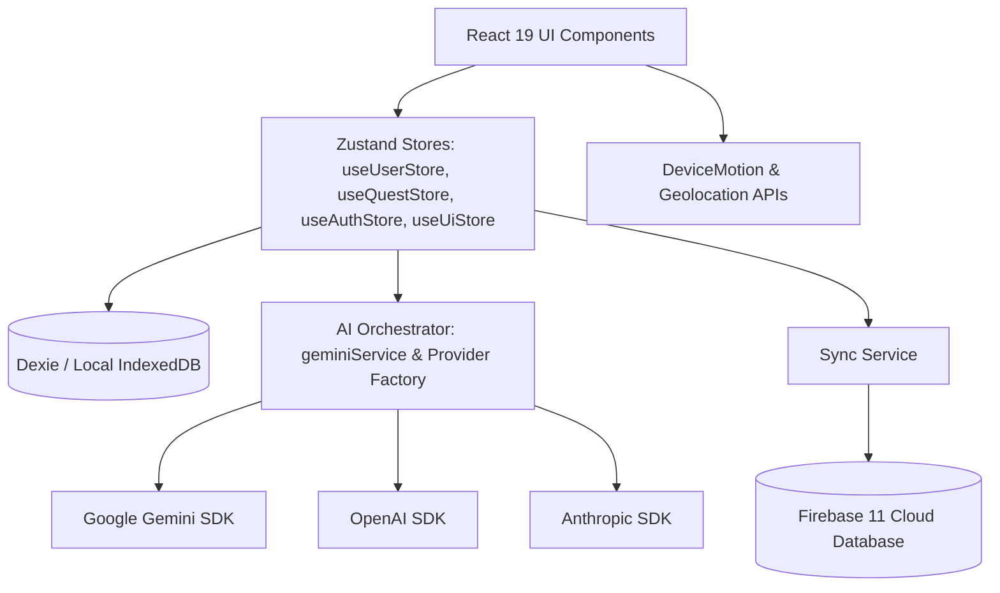

# 🌌 VoidFit AI — Fitness OS

VoidFit AI is a premium, gamified, AI-powered Fitness OS that turns your daily physical training, recovery, and nutrition habits into a immersive Role-Playing Game (RPG). Earn Experience Points (XP), level up your character, allocate skill points on a customizable skill tree, complete dynamically generated daily quests, claim real-world geographical zones, and collaborate or compete with friends in guilds and PvP.

Built using **React 19**, **TypeScript**, and **Vite 6**, the app is engineered to be **offline-first** (powered by **Dexie** and **IndexedDB**) with optional cloud synchronization through **Firebase 11**.

---

## 🚀 Architectural Overview



### Key Pillars of the Application
1. **Offline-First Storage**: User state, quests, logs, and analytics are persisted locally in the browser's IndexedDB. The app remains fully functional without an active internet connection.
2. **AI Orchestration**: Flexible, multi-provider abstraction supporting **Google Gemini**, **OpenAI**, and **Anthropic** for generating real-time coach feedback, scanning meal images, and dynamically adjusting quest difficulties.
3. **Advanced Web APIs**: Leverages hardware features such as the `DeviceMotion` API for step tracking and the `Geolocation` API for zone claiming.

---

## ✨ Features in Detail

### 1. 🤖 AI Coach & System Reactions
- **Real-Time Analysis**: Processes system events (like completing workouts or failing commitments) and responds with context-aware, encouraging, or firm feedback.
- **Vision Tracking**: Use your device's camera to analyze food plates, extract macro-nutrients (calories, protein, carbs, fats), and log them directly.
- **Dynamic Missions**: Generates daily challenges based on your historical fitness performance, body diagnostics, and current fitness goals.

### 2. 🎮 RPG Gamification System
- **Character Progression**: Gain XP, level up, unlock achievements, and gain ranks.
- **Skill Tree**: Unlock nodes in multiple paths (Strength, Endurance, Mindfulness, Nutrition) to gain modifiers, virtual perks, or custom character buffs.
- **Punishment System**: Keep your commitments. If you fail to log daily tasks or hit step goals, the app inflicts in-game status penalties and health reductions.

### 3. 🗺️ Geolocation & Territory Mapping
- **Zone Claiming**: As you walk or run outside, the app tracks your position via the `Geolocation` API and plots your path on an interactive map.
- **Map Regions**: Claim zones in your local neighborhood and defend them in multiplayer mode or view other guild members' claimed territories.

### 4. 👟 Hardware Step Tracking
- Uses the device's accelerometer via `DeviceMotion` to track steps locally in the browser, estimating distance, pace, and active calories.

### 5. 👥 Multiplayer & Guilds
- **Guild Hub**: Join forces with other users to tackle raids and shared challenges.
- **Leaderboards**: Daily, weekly, and global leaderboards tracking XP, steps, and completed quests.
- **PvP Arenas**: Challenge friends to step battles or hydration duals.

---

## 🛠 Tech Stack

| Component | Technology | Version | Description |
| :--- | :--- | :--- | :--- |
| **Core UI** | React | `19.2.0` | Declarative UI framework |
| **Language** | TypeScript | `~5.8.2` | Type-safety and auto-documentation |
| **Bundler** | Vite | `6.2.0` | Fast building and Hot Module Replacement |
| **Styling** | Tailwind CSS | `4.2.4` | Utility-first modern CSS framework |
| **State** | Zustand | `5.0.13` | Minimal, fast, and scalable state stores |
| **Local Storage** | Dexie | `4.4.2` | Elegant wrapper for browser IndexedDB |
| **Cloud Sync** | Firebase | `11.10.0` | Authentication, Firestore sync, and backup |
| **Animations** | Framer Motion | `12.36.0` | Smooth UI transitions and micro-interactions |
| **Data Viz** | Recharts | `3.8.0` | Interactive dashboard charts |
| **Maps** | Leaflet | `1.9.4` | Open-source interactive map engine |
| **Validation** | Zod | `4.4.3` | Strong schema parsing for AI outputs |

---

## 📁 Project Structure Directory Map

```
levelup-app-clean/
├── auth/                      # Firebase & Third-party authentication
│   └── googleAuth.ts          # Google OAuth Flow hooks and actions
├── components/                # UI Presentation & Layout components
│   ├── Dashboard/             # Main dashboard UI, statistics HUD, and mission cards
│   ├── diagnostics/           # Error boundary interfaces and system diagnostics
│   ├── journal/               # Daily progress logging UI
│   ├── multiplayer/           # Guild management, leaderboards, and PvP systems
│   ├── Onboarding/            # Multi-step user profile setup wizard
│   ├── territory/             # Geolocation Leaflet map and area claim UI
│   ├── ActionHub.tsx          # Router-level action panel
│   ├── SkillTree.tsx          # Interactive character progression skill node rendering
│   └── ...
├── services/                  # Global application services
│   └── geminiService.ts       # Direct Gemini SDK integrations and API call configurations
├── src/                       # Central application codebase
│   ├── app/                   # Core application configuration
│   │   ├── initialization/    # Global database and authentication warm-up scripts
│   │   ├── notifications/     # Notification overlay and system alerts management
│   │   ├── shell/             # AppShell (global layout wrapper) & AppRouter
│   │   └── theme/             # Global visual modes (Dragon, Cyber, Mystic)
│   ├── config/                # Global configuration and feature flags
│   ├── db/                    # Dexie configuration
│   │   ├── database.ts        # Database schema definitions
│   │   └── useDatabase.ts     # Dexie query hooks for React components
│   ├── hooks/                 # General hooks (fullscreen, timers, voice)
│   ├── services/              # Core business logic
│   │   ├── ai/                # Multi-provider wrappers (Gemini, OpenAI, Anthropic)
│   │   │   ├── providerFactory.ts
│   │   │   └── types.ts
│   │   ├── AiSpiderwebService.ts
│   │   ├── DailyReportService.ts
│   │   ├── MultiplayerService.ts
│   │   ├── PunishmentSystem.ts
│   │   └── TerritorySystem.ts
│   ├── store/                 # Zustand global stores
│   │   ├── useUserStore.ts    # User progress, XP, Level, Stats
│   │   ├── useQuestStore.ts   # Active and completed quests
│   │   ├── useAuthStore.ts    # Credentials and API keys
│   │   └── useUiStore.ts      # Active screen state and view routers
│   └── types/                 # Standardized system TypeScript declarations
├── tests/                     # Integration and Unit testing suites
│   ├── aiAbstraction.test.ts
│   ├── dbCrud.test.ts
│   └── userStore.test.ts
├── package.json               # Scripts and core dependencies
├── vite.config.ts             # Vite server and bundler config
└── tsconfig.json              # TypeScript engine configurations
```

---

## 🚀 Setup & Installation

### Prerequisites
- **Node.js**: `18.x` or higher (tested with `20.x` and `22.x`)
- **npm**: `9.x` or higher

### 1. Clone & Install Dependencies
Clone the repository and run `npm install`:

```bash
git clone https://github.com/kairu12/voidfit-ai-fitness-os.git
cd voidfit-ai-fitness-os
npm install
```

### 2. Configure Environment Variables
Create a local `.env` file in the root directory (based on [.env.example](file:///c:/Users/black/Downloads/Levelup-app-production-ready/Levelup-app-clean/.env.example)):

```bash
cp .env.example .env
```

Open `.env` and provide your API keys:

```env
# Google OAuth Client ID (Required for Google login)
VITE_GOOGLE_CLIENT_ID=your_google_oauth_client_id

# Firebase Settings (Optional, app falls back to offline IndexedDB)
VITE_FIREBASE_API_KEY=your_firebase_api_key
VITE_FIREBASE_AUTH_DOMAIN=your_project.firebaseapp.com
VITE_FIREBASE_PROJECT_ID=your_project_id
VITE_FIREBASE_STORAGE_BUCKET=your_project.appspot.com
VITE_FIREBASE_MESSAGING_SENDER_ID=your_sender_id
VITE_FIREBASE_APP_ID=your_app_id
```

### 3. Local Development Scripts

| Command | Action | URL / Output |
| :--- | :--- | :--- |
| `npm run dev` | Runs local dev server | `http://localhost:3000` |
| `npm run build` | Compiles codebase for production | Outputs to `dist/` |
| `npm run preview` | Runs local preview of production build | `http://localhost:3000` |
| `npm run test` | Runs all Vitest suites | Console reports |

---

## 🧠 Development Conventions & Extensibility

If you are extending the application or modifying AI-driven workflows:

1. **New AI Feature**: Create the appropriate call site. If it is a chat-related call, extend the provider abstract class in `src/services/ai/`. Update `docs/ai-surface-map.json` to keep track of active AI connections.
2. **New Routes**: Add the state configuration to the `useUiStore` routing options and register the visual component within [AppRouter.tsx](file:///c:/Users/black/Downloads/Levelup-app-production-ready/Levelup-app-clean/src/app/shell/AppRouter.tsx).
3. **Database Schema changes**: If you edit tables, make sure to bump the database schema version inside [database.ts](file:///c:/Users/black/Downloads/Levelup-app-production-ready/Levelup-app-clean/src/db/database.ts) to trigger the correct IndexedDB migrations.

---

## 🔒 Privacy & Data Policy
- **Local Storage**: All fitness journals, steps, GPS paths, and weights are saved on-device using IndexedDB. No user data is sent to external servers by default.
- **Firebase Sync**: Enabling Firebase Cloud synchronization is entirely optional. When active, data is synced to your private Firebase container.
- **AI Keys**: Provider API keys (Gemini, Anthropic, OpenAI) are saved securely on-device using encrypted local preference stores and are sent directly to the AI provider endpoint via HTTPS without any middleman servers.

---

## 📄 License
This project is licensed under the **MIT License**.
